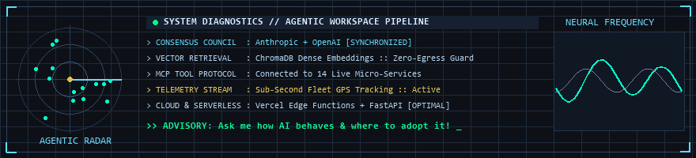

 

 

<!-- Holographic Futuristic AI HUD Matrix Animation -->

 
 

### 🏆 GitHub Achievements & Rank Trophies

 
 

### 🛠️ Tech Arsenal & Stack

#### 🤖 AI, Frontier Frameworks & Autonomous Agents

#### 💻 Frontend, Mobile & Desktop

#### ⚙️ Backend, Cloud & Serverless

---

### 💡 Core Focus & AI-Era Interests

* 🤖 **Autonomous Multi-Agent Workflows:** Developing collaborative consensus councils, dynamic query routers, and automated pre-egress PII sanitization for secure enterprise environments.
* 🧠 **Frontier AI Ecosystems:** Architecting hybrid systems leveraging Anthropic, OpenAI, Google Gemini, and local sovereign LLMs.
* 🛠️ **Model Context Protocol (MCP) & Tooling:** Building custom MCP servers, semantic vector search with ChromaDB, and LangChain pipelines.
* ☁️ **Cloud & Serverless Architectures:** Deploying scalable edge functions on Vercel, Firebase real-time sync, and high-performance FastAPI backends.
* 📱 **High-Performance Cross-Platform Apps:** Building modern React 19 PWAs, Flutter 3.x radar applications, and native desktop clients with Tauri 2.0.

---

### 📈 Contribution Activity Graph

---

  Building the future of Autonomous Agentic Workflows, Sovereign Edge AI & Cloud Systems.

